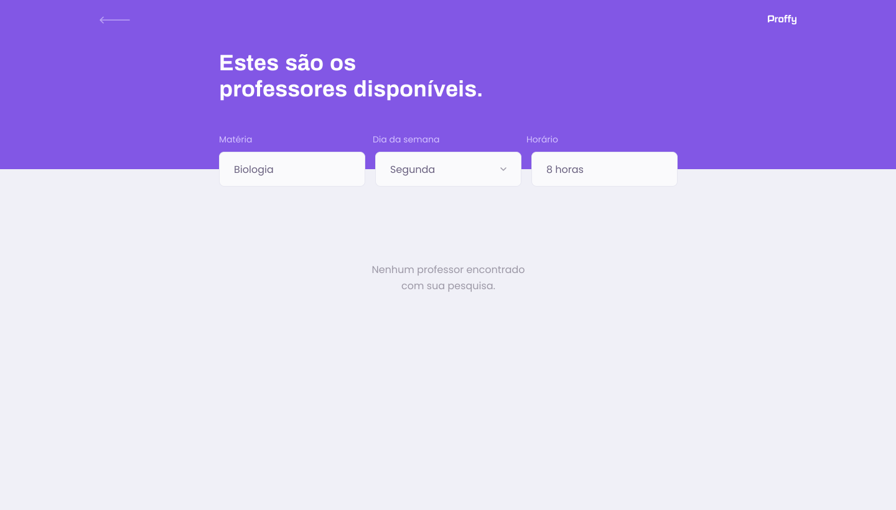

<h3 align="center">
    
    <br /><br />
    <b>👨‍🏫Next Level Week 2.0 - OmniStack👩‍🔬</b>  
    <br>
</h3>

<h3 align="center">
  Application link:
  <a href="https://maycongc.github.io/proffy-web">
    Proffy
  </a>
</h3>
<br/>

# Índice

- [Sobre](#sobre)
- [Tecnologias Utilizadas](#tecnologias-utilizadas)
- [Layout](#layout)
- [Como Usar](#como-executar)
- [Como Contribuir](#como-contribuir)

<br />
<a id="sobre"></a>

# 💻 Sobre o projeto

><strong>Proffy</strong> é uma plataforma de estudos online, onde quem quiser pode divulgar o curso que irá ministrar, e pessoas interessadas no conteúdo, conseguem facilmente entrar em contato.

### As pessoas interessadas em ministrar cursos poderão se cadastrar na plataforma enviando:
- Nome completo
- Link para sua foto de perfil
- Whatsapp
- Uma biografia curta
- Matéria que ira lecionar
- Custo da sua hora por aula
- Hórario disponível

### Os usuários interessados nas aulas poderão:
- Pesquisar professores filtrando por:
  - Matéria
  - Dia da semana
  - Horário
- Entrar em contato com o prefessor desejado

>Projeto desenvolvido durante a **NLW - Next Level Week #02** oferecida pela [Rocketseat](https://github.com/Rocketseat).
O NLW é uma semana cheia experiência online com muito conteúdo prático e didático, desafios e hacks onde o conteúdo fica disponível durante somente uma semana.

<br />
<a id="tecnologias-utilizadas"></a>

# 🚀 Tecnologias Utilizadas

O projeto foi desenvolvido utilizando as seguintes tecnologias

- [Node.js](https://nodejs.org/en/)
- [TypeScript](https://www.typescriptlang.org/)
- [ReactJS](https://reactjs.org/)

<a id="layout"></a>
<br />
# 🎨 Layout


<br />

<br />

<br />

<br />

<br />
<a id="como-executar"></a>

# 🔥 Como executar o projeto

- ### **Pré-requisitos**

  - **Necessário** possuir o **[Node.js](https://nodejs.org/en/)** instalado na máquina
  - **Necessário** possuir o gerenciador de pacotes **[Yarn](https://yarnpkg.com/)**.

### ✨ Faça um clone:

```bash
# Clone este repositório
$ git clone https://github.com/maycongc/proffy-web.git
```


### 🎲 Rodando a aplicação

```bash
# Acesse a pasta do projeto no terminal/cmd
$ cd proffy-web

# Instale as dependências
$ yarn

# Execute a aplicação em modo de desenvolvimento
$ yarn start

# A aplicação será aberta na porta:3000 - acesse http://localhost:3000
```

<br />
<a id="como-contribuir"></a>

# 😯 Como contribuir para o projeto

1. Faça um **fork** do projeto.
2. Crie uma nova branch com as suas alterações: `git checkout -b my-feature`
3. Salve as alterações e crie uma mensagem de commit contando o que você fez: `git commit -m "feature: My new feature"`
4. Envie as suas alterações: `git push origin my-feature`
> Caso tenha alguma dúvida confira este [guia de como contribuir no GitHub](https://github.com/firstcontributions/first-contributions)

<br />

## 📝 Licença

Esse projeto está sob a licença MIT. Veja o arquivo [LICENSE](LICENSE.md) para mais detalhes.

---

<h4 align="center">
    Feito com 💜 por Maycon Gorgonha 👋🏽 <a href="https://www.linkedin.com/in/maycon-gorgonha/" target="_blank">Entre em contato!</a>
<h4>
